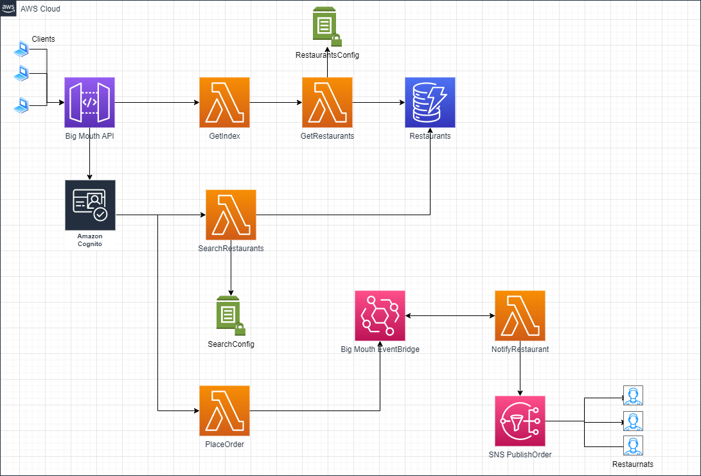

# Production Ready Serverless Workshop Architecture
This project was created from a 4 week serverless workshhop. The application is built using the [Serverless Framework](https://www.serverless.com/framework/docs) and covers how to build, deploy, and monitor complex backends on the aws platform using the serverless framework.

## Overview
Users access the the application services from the browser. In order to place orders and search restaurants users must be authenticated, which is handled by [AWS Cognito](https://docs.aws.amazon.com/cognito/latest/developerguide/what-is-amazon-cognito.html). [AWS SSM Parameter](https://docs.aws.amazon.com/systems-manager/latest/userguide/systems-manager-parameter-store.html) store is used to provide route configurations i.e number of `defaultResults`, and `authToken`. Testing for the application includes acceptance and integration test. The application is delivered through [GitHub Actions](https://docs.github.com/en/actions) and includes the workflow `dev.yml` that must be configured with you aws account.

## Required Software
 - [Node.js@14.x](https://nodejs.org/download/release/v14.19.3/) 
 - [AWS CLI](https://aws.amazon.com/cli/)
 - [Serverless Framework](https://www.serverless.com/framework/docs)

## Workshop Objectives
* implement server-side rendering
* authenticate users with Cognito
* securing internal APIs
* testing strategies for serverless
* CI/CD best practices
* manage application configurations
* security best practices
* logging best practices
* monitoring and alerting best practices
* implement distributed tracing
* capture and forward correlation IDs

## TechStack
* Node.js
* AWS Lambda
* AWS DynamoDB
* AWS EventBridge
* AWS SNS
* AWS SSM
* APIGateway